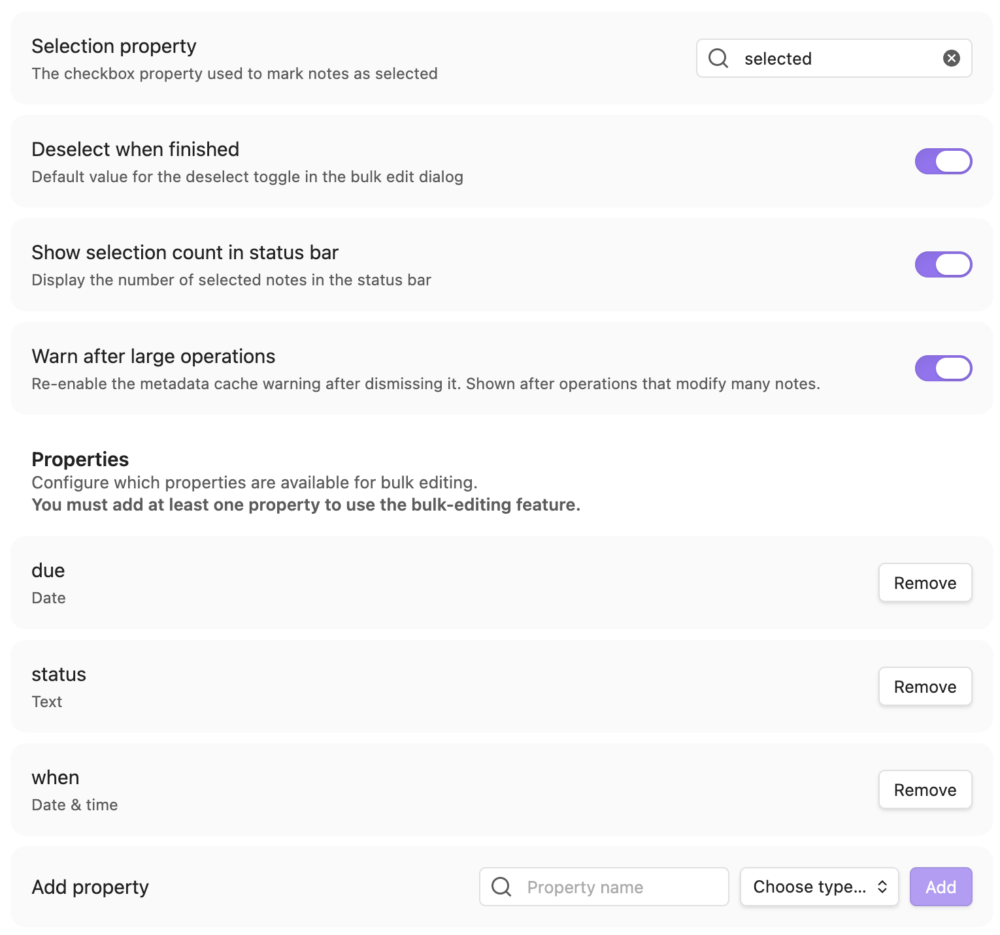
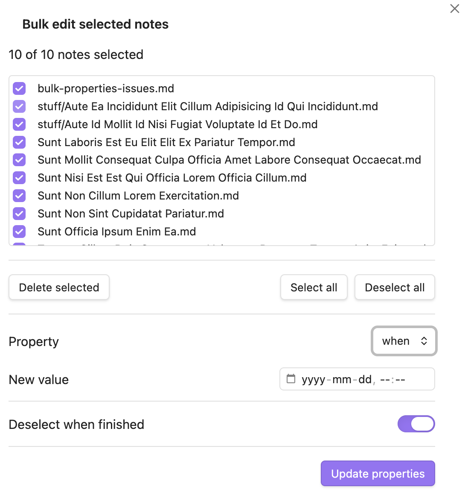

## Background

My wife uses [Obsidian](https://obsidian.md/) for task management and wanted to select a few notes
in a base and bulk-edit a property on them (e.g. to move tasks to a different day).

I wrote a custom Obsidian plugin named "Bulk Properties". It has been submitted to Obsidian for
inclusion in the Community Plugins registry, but they are taking many months to approve new plugins
so currently must be installed from GitHub, or using [BRAT](https://github.com/TfTHacker/obsidian42-brat).

### Plugin options

The plugin's options let you define a checkbox property to serve as the selection mechanism, and
choose which properties you want available for bulk-editing.

### Bulk editing

With one or more notes selected in a base, invoke the `Bulk Properties: Bulk edit selected notes`
command (or use the ribbon icon) to bring up the dialog. Select the property to modify, and enter
the new value. For multi-value properties (e.g. tags, lists) there is an option to add new values,
replace all existing values, or delete the provided value.

### Other features

The bulk edit dialog includes the ability to delete the selected files, instead of editing their
properties. This uses whatever deletion mechanism is configured in Obsidian (system trash, Obsidian
trash, or permanently delete).

A note's file menu includes the "Select for bulk edit" command (changes to "Deselect for
bulk edit" if the note is already selected).

The "Bulk Properties: Deselect all notes" command will uncheck any currently selected notes; notes
that don't have the selection property at all will not be modified.

The "Bulk Properties: Remove selection property from all notes" can be used if you want to change
the property used for indicating selection and first want to remove the existing property.

### Future work

No other features planned at this time.

### Learnings

This was my first time wiring up and using the GitHub releases pipeline (all my prior projects
were either built and released using other mechanisms (e.g. Jenkins) or everything was already
setup before I got involved).
