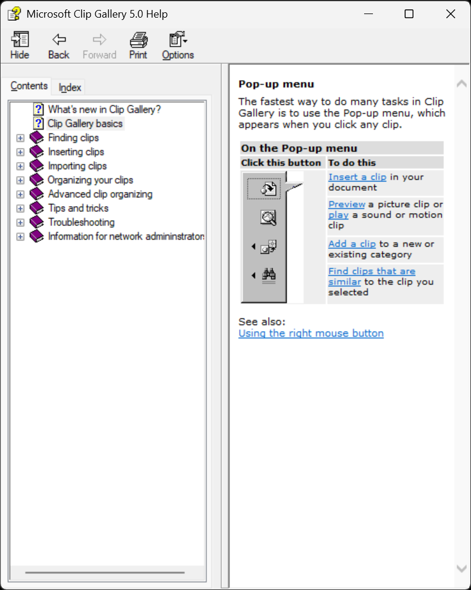
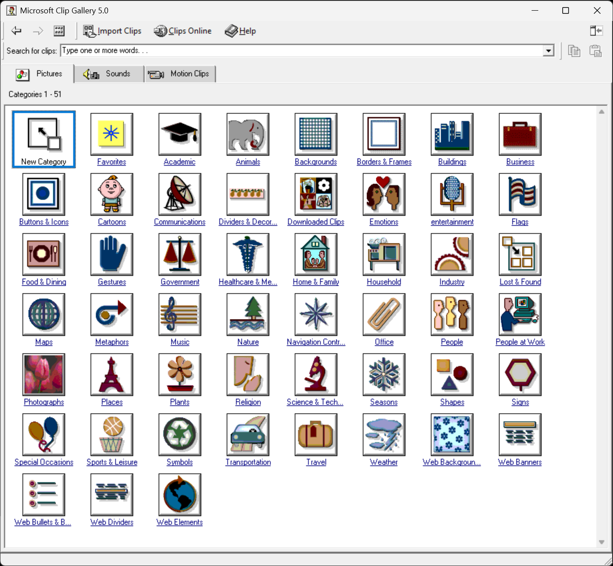
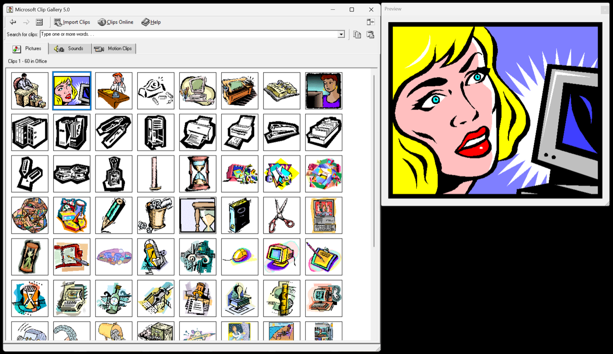
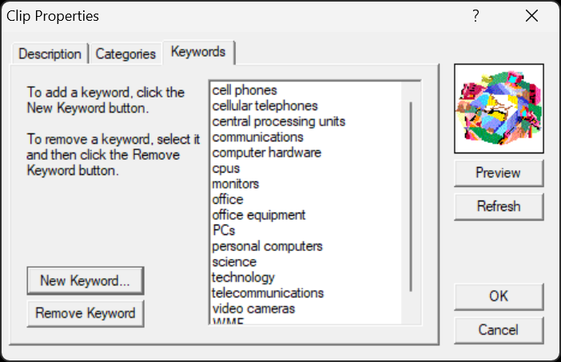
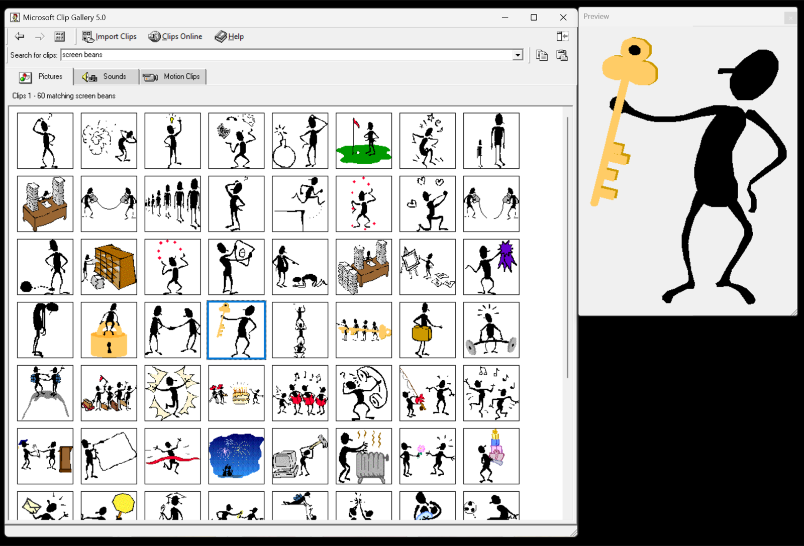
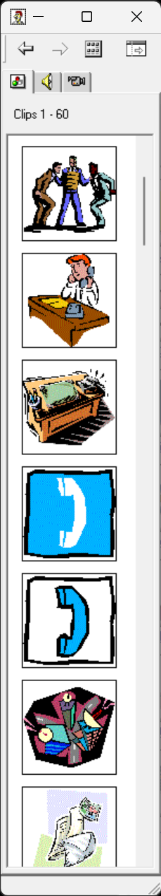

## The Evil Empire

I joined Microsoft as a developer in 1997, starting on the MediaStore team and working on Clip Gallery 5.0 (CAG-5).

CAG-5 was released with Office-2000, Microsoft Works, and some other long-forgotten software such as Microsoft Home Publishing.

## CAG History

One fun aspect of being at Microsoft was access to most previously released software, letting me play with things I
had never used in the real world, such as [Windows 1.0](https://en.wikipedia.org/wiki/Windows_1.0) and
[Microsoft Bob](https://en.wikipedia.org/wiki/Microsoft_Bob).

I remember setting up my old [Epson Equity](https://en.wikipedia.org/wiki/Epson_Equity) PC I bought in the 1980s
(monochrome monitor, Hercules graphics, 20MB hard-drive) for a new hire at Microsoft circa 1998, with Windows 1.0
installed. Hilarity ensued, at least in my head.

Anyway, back to CAG history.

- CAG-4 only shipped with Microsoft Publisher, releasing right around the time I was hired
- CAG-3 was shipped as part of Microsoft Office-97 (maybe also Office-95)
- CAG-2 and CAG-1 (which weren't called "Clip Gallery", but maybe "Clipart Gallery" or "Art Gallery") shipped with early
  versions of what became Publisher, I believe (but don't quote me on that) and probably also with Office 4.2/4.3. It's
  been almost 30 years, so I could be off on some or all of this.

## What I Worked On

The first thing I remember building was the "popup-control", a custom widget that displayed when you selected a clip
and provided common actions such as inserting or previewing the asset, or editing its categories and keywords.

Other than that I vaguely recall improvements to the thumbnail/grid control, performance things, and improving
accessibility. Probably a lot more, but again, almost 30 years ago! There was an easter egg in the About dialog in
early releases of CAG-5, but we removed that for... reasons.

Here's the help page on the pop-up control from the Office-2000 help.

## Memories of Development Process

I don't know where MediaStore lived, organizationally, but it wasn't a direct part of the Office organization at the
time I joined. CAG did not use the shared Office codebase (MSO.dll) but was, I believe, an [MFC](https://en.wikipedia.org/wiki/Microsoft_Foundation_Class_Library) application. I don't remember if we built it via a Visual Studio project (if that was
a thing yet in 1997...) or actual nmake files.

We used [Visual SourceSafe](https://en.wikipedia.org/wiki/Microsoft_Visual_SourceSafe) for source control, which I quickly
learned was somewhat unusual inside Microsoft. It was a pain, with frequent database corruption, locks, and other joys.

I probably used Visual Studio as my development environment initially, but over the years I stopped using it except
for debugging, preferring [Source Insight](https://www.sourceinsight.com) for most editing, with occasional forays into
`vi` variants. Though in later years I may have started using it again for C# work. I thought of Visual Studio in the same
category as Microsoft Outlook and Flight Simulator, namely, software that no computer was ever quite powerful enough to run
comfortably. Now, with Electron-based apps being the norm, those old monsters don't seem so bad in retrospect.

## Screenshots

Here are some examples of CAG in action. What's amazing is that I installed CAG-5 via installing Office-2000
onto my Windows-11 PC. It worked, and this is how I captured these screenshots.

For all the Microsoft bashing, backwards compatibility has always been amazing in core Microsoft-land.

## After CAG (The Sequel)

After CAG-5, I helped bootstrap its replacement, Clip Organizer, which I'll talk about in a future scintillating article.
