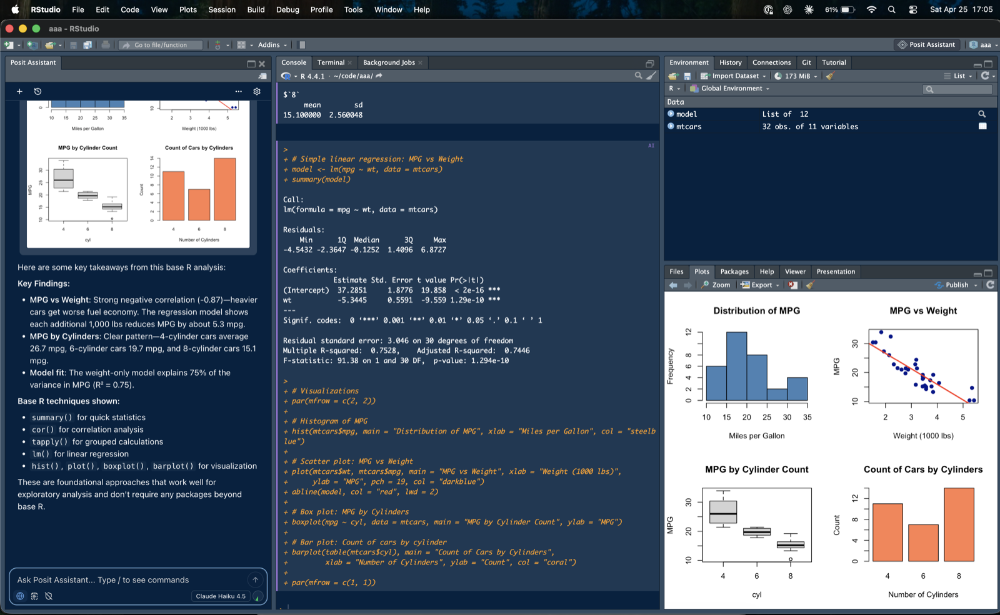

## History

RStudio started as a personal project of [JJ Allaire](https://en.wikipedia.org/wiki/Joseph_J._Allaire)
around 2009, with the first public beta in 2011.

I joined [RStudio (the company, now named Posit PBC)](https://en.wikipedia.org/wiki/Posit_PBC) in
2016 to work on [RStudio (the IDE)](https://en.wikipedia.org/wiki/RStudio). I'm still
working for Posit, still working primarily on RStudio.

### Tech Stack

The majority of the user interface is built using the [Google Web Toolkit (GWT)](https://www.gwtproject.org/)
which transpiles Java sources to JavaScript. This enables RStudio to be used both as a server-based
application reached via web-browser, or as a desktop application using Electron to host the web UI.

#### RStudio Desktop

Electron wasn't a thing when RStudio was created. Initially it used `QtWebKit` from the
[Qt framework](https://www.qt.io/development/qt-framework) for Windows and Linux, and the `WebKit`
framework's `WebView` class for macOS. This was updated to `QtWebEngine`, and the Mac-specific variant
combined back into a unified codebase. In the early 2020s, we moved to Electron.

#### RStudio Server

RStudio Server runs a C++ backend process that acts as an http server, and can start one or more
"R session" processes via another C++ component that links with the R libraries.

#### RStudio Pro (Workbench)

The commercial version of RStudio used to be known as RStudio Server Pro, but is now called RStudio
Pro and is just one of the IDEs available in [Posit Workbench](https://posit.co/products/enterprise/workbench).

## My Features

I've worked on a wide variety of features in RStudio. Here are some of the more interesting ones, at
least to me.

### Terminal Pane

My first feature was adding the terminal pane to RStudio, using [xterm.js](https://xtermjs.org). On
Windows, I had to use [winpty](https://github.com/rprichard/winpty) to provide the pty-like features
that are built in to macOS and Linux. Windows 11 (and later builds of Windows 10) include a real
implementation,
[ConPTY](https://devblogs.microsoft.com/commandline/windows-command-line-introducing-the-windows-pseudo-console-conpty/),
but we haven't switched to it yet.

### Licensing

RStudio Desktop Pro is a paid (closed-source) version of RStudio, mostly adding support and
licensing. I added the licensing, which uses [LimeLM](https://wyday.com/limelm/). This was already
used to license Workbench and other commercial products, but those were all Linux-only server
products, so I had to extend to include macOS and Windows support.

### Accessibility

RStudio had extremely poor accessibility for keyboard-only and screen-reader users. I did a bunch
of work to improve this, including changes to our GWT fork, and now most of the product can be used
via the keyboard and meets contrast standards.

Screen-reader support is still problematic in some areas, but I try to chip away at it when I can.

As part of this, I became very familiar with WCAG, using screen readers (VoiceOver, JAWS, NVDA), and
performing formal accessibility audits. I used [Be Inclusive](https://beinclusive.app) to capture
and share results.

### Electron

I did the bulk of the work to move RStudio from QtWebEngine to Electron.

### Posit Assistant

Most recently, I was heavily involved in bringing agentic coding to RStudio via integration of
Posit Assistant. This included adding the sidebar pane (full-height column), implementing a
downloadable plug-in model for the AI features (they don't ship with RStudio itself but are an
optional feature), and bootstrapping the overall architecture. This shipped in April 2026, after a
few months of closed and open betas.

### What's Next?

Although Posit has put a lot of focus on the [Positron IDE](https://positron.posit.co/), RStudio
itself is still very widely used, and there is a never-ending list of features and issues to tackle,
so not likely to be bored anytime soon.

