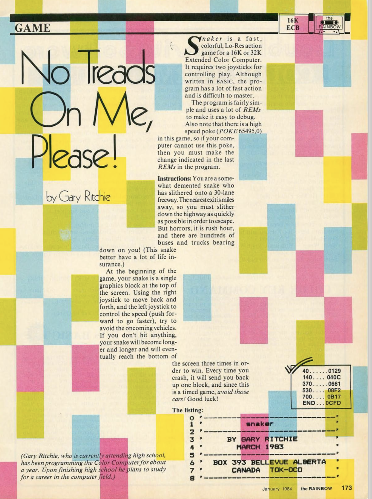

## History

In early 1983 I wrote _Snaker_ for the TRS-80 Color Computer, and submitted it to [The Rainbow](<https://en.wikipedia.org/wiki/The_Rainbow_(magazine)>) magazine.

Submission was via mailing a cassette tape with the source code. It was accepted and [appeared in the January 1984 issue](https://archive.org/details/rainbowmagazine-1984-01/page/n171/mode/2up). I believe I was paid something on the order of $25. American!

### Magazine Cover

### First Page of Article

## Background

Snaker relies on the screen scrolling mechanism to move everything up one line. So I draw the "cars" at the bottom and they move along the highway via the screen scrolling. The snake starts at the top and gradually moves down (or back up if it collides with a car). This gives the snake-like appearance as the player moves left and right.

Taking advantage of this allowed more to happen on-screen than would be possible with plain BASIC code. To give an idea of just how slow this interpreted language was on this hardware, pausing for one second was achieved via a no-op `for` loop of 460 iterations. Keeping source code as small as possible (e.g. single-character variable names, avoiding all unnecessary whitespace) was a significant factor in application performance on the CoCo.

I stumbled across this idea while playing with a [Timex Sinclair 1000](https://en.wikipedia.org/wiki/Timex_Sinclair_1000). I was probably trying to write a Pong-style game with a paddle moving left and right at the bottom of the screen when I unintentionally triggered scrolling and saw the snake-like pattern.

## JavaScript Port

As I was building [my website](https://boringbydesign.ca) to list my past and current projects, I knew I'd have to include Snaker. I started by using Preview on the iPhone to capture the pages with the source listing from a physical copy of the magazine, then had Claude Cowork pull out the source from the pages and save it. From there I used Claude Code to create a JavaScript port.

For the most part, the gameplay is faithful to the original and includes support for keyboard play and touch controls.

I added an introductory screen that wasn't in the original; it gives instructions but, more importantly, provides the user interaction (press any key to continue) required to enable the sound to play on the next screen.

The sound is problematic (silent) on iOS (iPhone) due to known Safari quirks. Telling Safari to use the desktop version and making sure your ringer is not silenced usually works around this. On iPad and desktop, sound works without any workarounds.

[GAMEPLAY.md](https://github.com/gtritchie/snaker/blob/main/GAMEPLAY.md) explains how to play the (ported) game.

**Play it in your browser:** <https://boringbydesign.ca/snaker>

## Other Games

I wrote a few more games on the CoCo after this, mostly in assembly language, but none of them were accepted for publication. I no longer have the source code for these.
